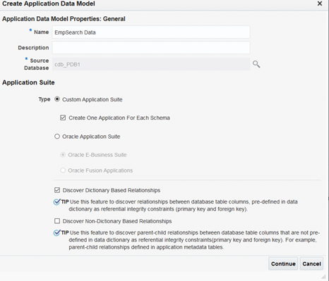
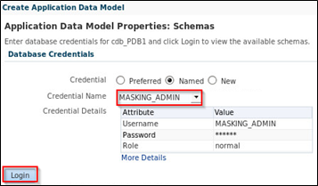
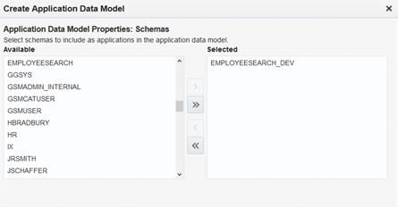
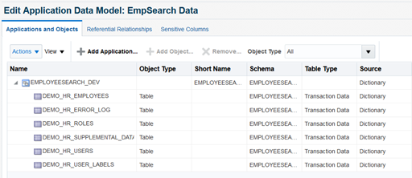

# Database Security Workshop: Data Masking

## Introduction

This is the one of several labs which are part of **Oracle Database Security Workshop.** This workshop will walk you through the process configuring, validating and using all of Oracle's Database Security products

### Data Masking

Oracle Data Masking pack for Enterprise Manager, part of Oracle's comprehensive portfolio of database security solutions, helps organizations comply with data privacy and protection mandates such as Sarbanes-Oxley (SOX), Payment Card Industry (PCI) Data Security Standard (DSS), Health Insurance Portability and Accountability Act (HIPAA), EU General Data Protection Regulation (GDPR), and the upcoming California Consumer Privacy Act (CCPA), and numerous laws that restrict the use of actual customer data. With Oracle Data Masking, sensitive information such as credit card or social security numbers can be replaced with realistic values, allowing production data to be safely used for development, testing, or sharing with out-sourced or off-shore partners for other non-production purposes. Oracle Data Masking uses a library of templates and format rules, consistently transforming data in order to maintain referential integrity for applications.

Data masking (also known as data scrambling and data anonymization) is the process of replacing sensitive information copied from production databases to test or non-production databases with realistic, but scrubbed, data based on masking rules. Data masking is ideal for virtually any situation when confidential or regulated data needs to be shared with other non-production users; for instance, internal users such as application developers, or external business partners, like offshore testing companies or suppliers and customers. These non-production users need to access some of the original data, but do not need to see every column of every table, especially when the information is protected by government regulations. 

Data masking allows organizations to generate realistic and fully functional data with similar characteristics as the original data to replace sensitive or confidential information. This contrasts with encryption or Virtual Private Database, which simply hide data, allowing the original data to be retrieved with the appropriate access or key.  With data masking, the original sensitive data cannot be retrieved or accessed.  Names, addresses, phone numbers, and credit card details are examples of data that require protection of the information content from inappropriate visibility. Live production database environments contain valuable and confidential data — access to this information is tightly controlled. However, each production system usually has replicated development copies, and the controls on such test environments are less stringent. This greatly increases the risks that the data might be used inappropriately. Data masking can modify sensitive database records so that they remain usable, but contain no confidential or personally identifiable information. Yet, the masked test data resembles the original in appearance to ensure the integrity of the application. 

## LAB EXERCISE 100 – CREATING AN APPLICATION DATA MODEL (ADM)

- Login to Enterprise Manager as SYSMAN / Oracle123 

- Navigate to the Application Data Models page like this:
    - Select the tab Enterprise
    - Select Quality Management 
    - Select Application Data Models

- Briefly review the Secure Test Data Management diagram to familiarize yourself with the process. 

- Click Create

    

- You will create a new ADM called Employee Data on the pdb1 database.
    - Notice the options to create ADMs for Oracle Enterprise Business Suite (EBS) and Fusion Applications
    
- Chose the option type, **Custom Application Suite** and checkbox the option, **Create One Application For Each Schema** (default)

- Name the ADM: **EmpSearch Data**
    - Click the spyglass for Source Database and select **cdb_PDB1**
    
        

- Login to the PDB1 database as MASKING_ADMIN / Oracle123

    

- Select the **EMPLOYEESEARCH_DEV** schema for the application data model and then click the Continue

    
    
- Click the Submit button to schedule the job

    
    
    
    
- Once the job completes, the EMPLOYEESEARCH_DEV ADM will no longer be in a locked, uneditable, status.

    
    
- Highlight the ‘Employee Data’ Application Data Model and click the ‘Edit’ button.  

    

- You may be asked for database credentials.  Select NAMED crdentials and choose MASKING_ADMIN

    
    
- In the Edit Application Data Model: Employee Data screen, notice the applications for EMPLOYEESEARCH_DEV have been created based on the schema. Under the menu View, select the sub-menu Expand All to see the full list of tables associated with these applications

    
    
- Now view the referential relationships captured in the ADM.  Click the tab, ‘Referential Relationships’.  Expand the entire list of applications (Menu View à Submenu Expand All) to examine the referential relationships under each application.  Now that Cloud Control is aware of the foreign keys, it will automatically apply the same format masks to child tables.

    
    
**NOTE:** If there is not defined referntial integrity, the Data Masking Pack provides administrators with the ability to register these relationships so that the columns in the related tables (e.g. USERID in the DEMO_HR_USERS and DEMO_HR_ROLES tables) are masked identically using the same masking rules.

#### Summary

In this lab, you used Oracle Data Masking and Subsetting to perform the following:

- Create an Application Data Model.
- Viewed the referential relationships and saw the primary key and foreign key relationships captured.
- Learned how referential relationships not included in the Data Dictionary (typically those enforced in Application code) can be added manually.

**This completes this Lab!**