# Database Security Workshop: Oracle Key Vault

## Introduction

This is one of several labs which are part of **Oracle Database Security Workshop.** This workshop will walk you through the process configuring, validating and using all of Oracle's Database Securtity products

Oracle Key Vault enables you to quickly deploy encryption and other security solutions by centrally managing encryption keys, Oracle wallets, Java keystores (JKS), Java Cryptography Extension keystores (JCEKS), and credential files. Oracle Key Vault is optimized for managing Oracle Advanced Security Option/Transparent Data Encryption (TDE) master keys. The full-stack, security-hardened Oracle Key Vault software appliance uses Oracle Linux and Oracle Database technology for security, availability, and scalability. This centralized approach addresses challenges that are caused by the increased use of keys, wallets, and keystores, and prevents their accidental loss, while enabling long-term retention and restoration of encrypted data. In addition to supporting Oracle database and application servers, Oracle Key Vault follows the industry standard OASIS Key Management Interoperability Protocol (KMIP) for compatibility with KMIP-based clients.

***To log issues***, click here to go to the [github oracle](https://github.com/oracle/learning-library/issues/new) repository issue submission form.

## Required Artifacts

- The following lab requires:
  - Laptop (Windows, Mac or Linux)
    - If running  Windows: [Putty and PuttyGen](https://www.chiark.greenend.org.uk/~sgtatham/putty/latest.html)
  - VNC client
  - Oracle 18c Database
  - Enterprise Manager 13c

### LAB CONFIGURATION & DETAILS

- For these lab exercises, the following infrastructure components will be used.
  - Database: Database (pdb1) 
  - Key Vault 12..2 Server 

- Here is a summary of the users used in these labs.
 - KVADMIN / Oracle123+
 - OS Accounts and Passwords
  - oracle / Oracle123
  - root / Oracle123

- If accessing via VNC
  - :2 (5702) - oracle / Oracle123

## Protecting TDE Master Keys

### **STEP 1**: Getting the environment ready

- On the desktop, navigate to the Database_Security_Workshop folder, double-click and open the contents. 

  

- Select the folder, Oracle_Key_Vault.

  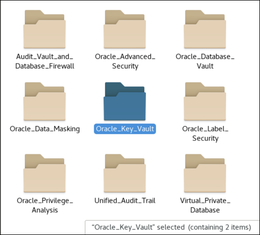

- Select the folder, KV_-_Getting_The_Environment_Ready.  

  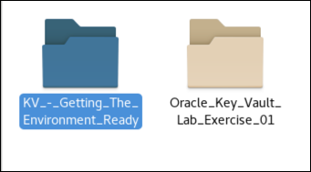

- In the KV_-_Getting_The_Environment_Ready folder, select Start_KV_Infrastructure.sh.  This script will start the infrastructure used in these lab exercises. In these lab exercises, use the Display button to view the contents of the scripts before executing.  This will allow you to review the steps, commands and scripts used in these exercises.  When executing scripts, use the Run in Terminal button.

  

  

- Please be patient as the infrastructure may take a little time to start.  Once the infrastructure has started, you are ready to move forward with the exercises.

### **STEP 2**: Key Vault Lab

#### Overview

-In this lab exercise, you will accomplish the following:
 - Define a default wallet for an endpoint.
 - Upload an existing wallet into Key Vault.
 - Reviewed the contents of the wallet and Key Vault. 

- Within the Oracle_Key_Vault folder, open the folder Oracle_Key_Vault_Lab_Exercise_01. You will see that there are some shell scripts.  Double click 01_okvutil_list.sh and click ‘Display’ to view the script in a terminal window and review what the script will do.  You can now click Run in Terminal which to execute the script.  Once the script has completed, the output will be in the file 01_okvutil_list.out.

  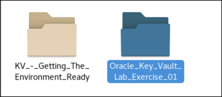

  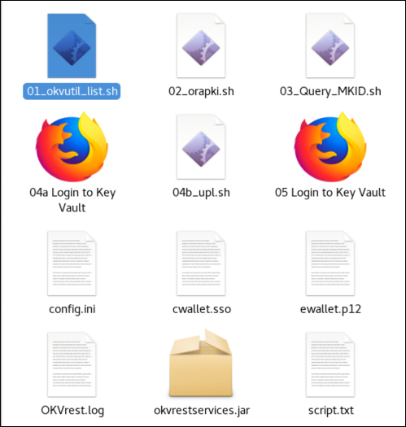

  

  Below is the result you should see in the terminal window. It shows the current contents of the Key
    Vault which you’ll note is empty except for a Template  file.

    

- Now that you have seen the current contents of the Key Vault, use the second script (02_orapki.sh) to show the contents of the Oracle Wallet.  

  

- Review the output from the 02_orapki.sh script. The output should look similar to this:

  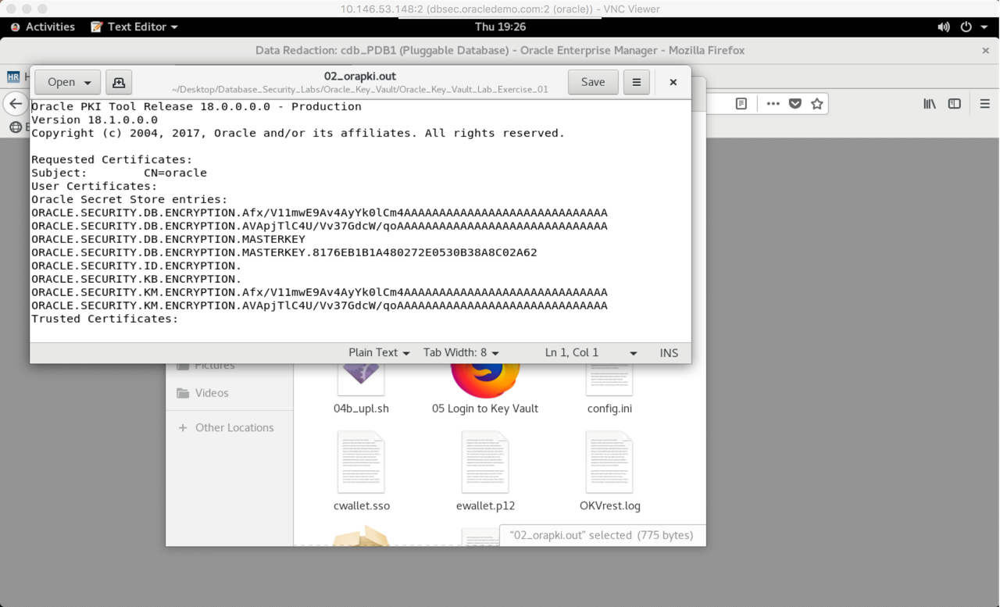

- Execute step 4 (04a Login to Key Vault).  This will bring up the Key Vault administrator console in the web browser.  Login as the KVADMIN user with password Oracle123+.

  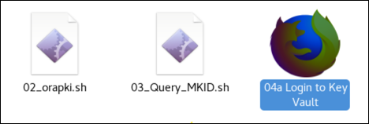

  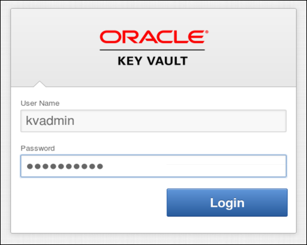

- To begin, navigate to the Keys and Wallets tab and Click the pencil for the cdb wallet.

  

  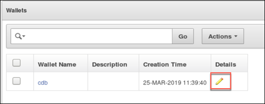

- Notice that the cdb wallet is associated with our DBSEC Endpoint.  The Endpoint has Read, Write, and Manage Wallet access.  

  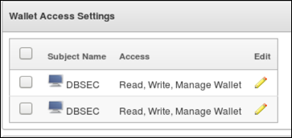

- Click the Endpoints tab and click the Endpoint Name DBSEC

  

  

- Notice that the Default Wallet for this Endpoint is cdb. This is where all of the objects we upload from this Endpiont will be stored. 

  

- Upload the contents of the Wallet into the Key Vault by returning to the Oracle_Key_Vault_Lab_Exercise_01 folder and executing the 04b_upl.sh script. 

  

  

  When prompted for passwords, enter Oracle123 for both the source wallet password and the Oracle Key Vault endpoint password. Once that is completed, the results are as follows:

  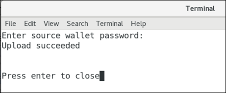

- To see that the wallet has been uploaded, return to the Key Vault console and select the Keys & Wallets tab at the top of the page. Check the wallet and click the Details icon.  Scroll down and note the MKIDs for the available TDE Master Keys. 

  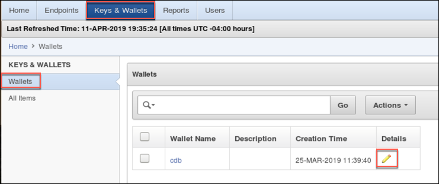

  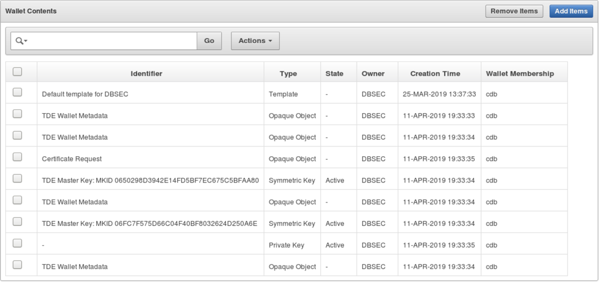

- Go back to the KV lab folder containing the scripts and double click the 03_Query_MKID.sh file

  

- Review the script output and note the MKID used to encrypt our EMPLOYEESEARCH_DATA tablespace

  

  

- Return to the KV ui and note the MKID's are the same

  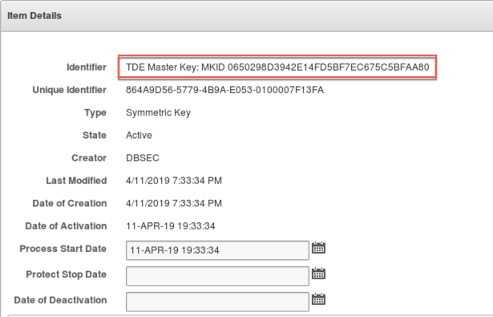

- You accomplished the following in this lab
 - Identified the default wallet for our DBSEC endpoint in OKV
 - Uploaded the wallet contents from the local wallet on the DB host to the virtual wallet in KV
 - Matched the MKIDs of the local wallet with those now available in OKV

**This completes this Lab!**
